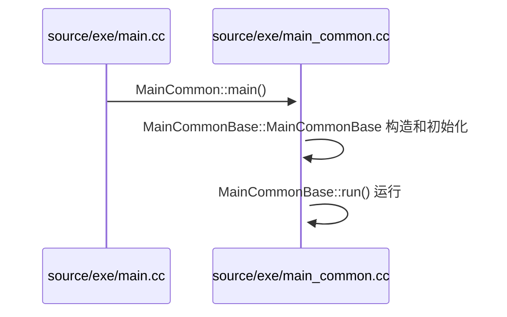
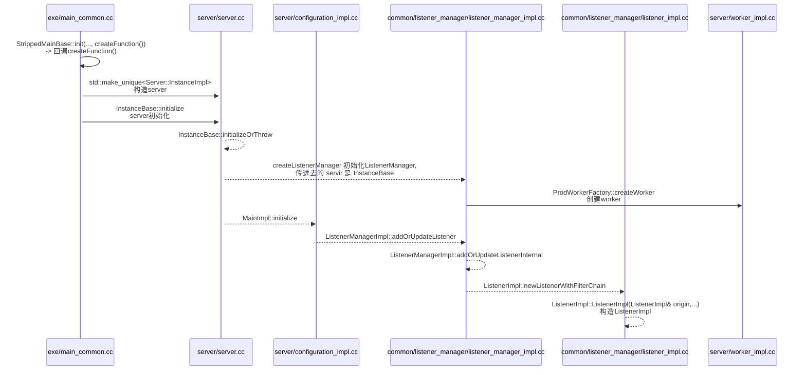
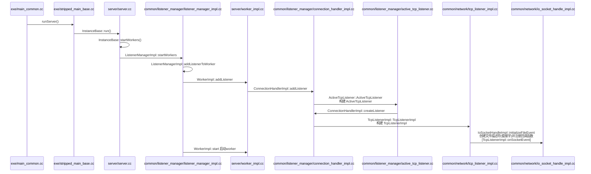
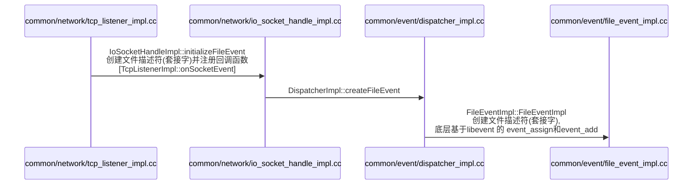
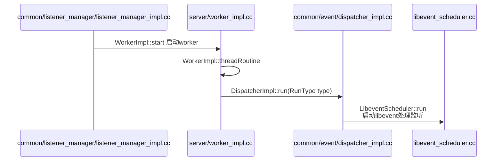
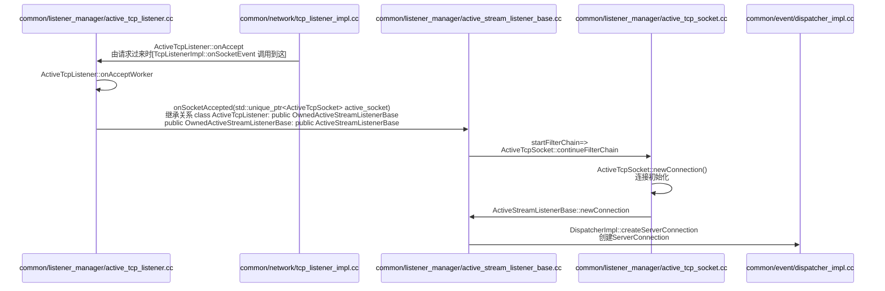
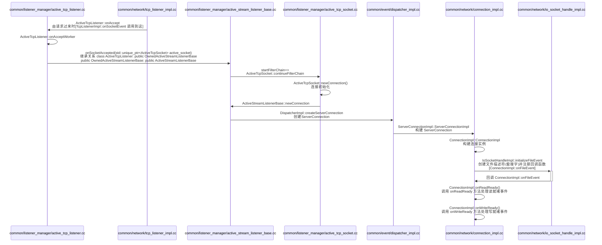
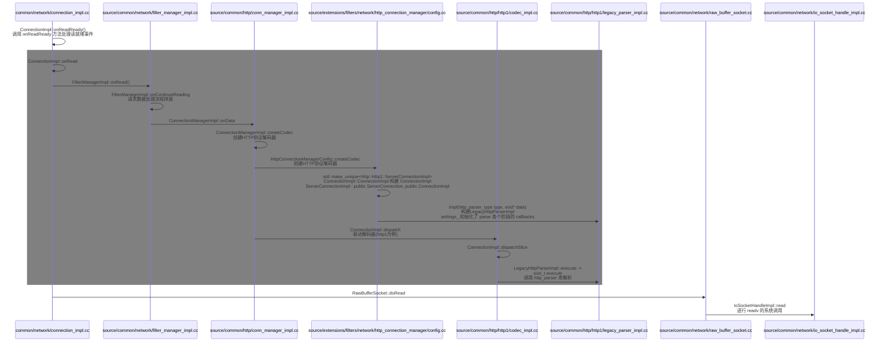

# Envoy 工程目录结构及关联详解

Envoy 是一个高性能的 C++ 分布式代理和通信总线, 其代码结构设计得非常模块化, 便于扩展和插件开发。以下是 Envoy 工程的主要目录结构及其关联关系: 

## 核心目录结构

```
envoy/
├── api/                    # 所有API的Protobuf定义, 插件配置应在此定义
├── bazel/                  # Bazel 构建系统相关文件
├── ci/                     # 持续集成配置
├── configs/                # 示例配置文件
├── contrib/                # 社区贡献的扩展, 可作为开发参考
├── docs/                   # 文档
├── envoy/                  # Envoy 代码库中最重要的头文件集合之一, 实际上是 source/common/ 的符号链接
├── source/                 # 核心源代码
│   ├── common/       # 跨组件通用功能
│   ├── exe/          # 可执行文件入口
│   ├── extensions/   # 所有扩展插件（最重要）
│   └── server/       # 服务器核心实现
├── test/                   # 测试代码
│   └── extensions/   # 扩展测试代码, 与主代码结构镜像
└── tools/                  # 开发工具, 如proto转换、格式检查等
```

## 重点目录详解

### 1. `envoy/` - 头文件集合目录

在 Envoy 项目的根目录下, `envoy/` 目录是一个**核心 C++ 头文件目录**, 它包含了 Envoy 的主要 C++ 类定义和公共 API 头文件。这个目录实际上是 `source/common/` 的**符号链接**（symlink）, 是 Envoy 代码库中最重要的头文件集合之一。

#### `envoy/` 目录的关键特点: 
1. **头文件集中地**: 
   - 包含 Envoy 核心组件的接口定义（`.h` 文件）
   - 所有主要功能模块的公共 API 都在这里声明

2. **模块化结构**: 
   - 每个子目录对应一个特定功能领域（如 `envoy/http/` 用于 HTTP 相关功能）
   - 与 `source/common/` 下的实现文件一一对应

3. **代码组织方式**: 
   - 采用 C++ 命名空间 `Envoy` 作为根命名空间
   - 子目录结构直接映射到命名空间（如 `envoy/buffer/` → `Envoy::Buffer`）

#### 典型子目录示例: 
```
envoy/
├── access_log/      # 访问日志接口
├── buffer/          # 数据缓冲区
├── common/          # 跨模块通用工具
├── event/           # 事件循环
├── http/            # HTTP 协议栈
├── network/         # 网络层
├── server/          # 服务器核心
├── ssl/             # SSL/TLS
├── stats/           # 统计指标
├── threading/       # 线程模型
└── upstream/        # 上游连接管理
```

#### 为什么这样设计？
1. **包含路径简化**: 
   - 代码中可以通过 `#include "envoy/http/filter.h"` 直接引用
   - 避免冗长的路径如 `#include "source/common/http/filter.h"`

2. **清晰的 API 边界**: 
   - 头文件集中展示公共接口
   - 实现细节隐藏在 `source/` 目录中

3. **Bazel 构建友好**: 
   - 通过符号链接保持构建系统的整洁
   - 保持与原始代码结构的兼容性

#### 开发者注意事项: 
1. 当你在开发插件时, 会频繁引用这个目录的头文件, 例如: 
   ```cpp
   #include "envoy/http/filter.h"        // HTTP 过滤器基类
   #include "envoy/registry/registry.h"  // 插件注册
   ```

2. 这个目录是**只读视角**, 实际修改应该在对应的 `source/common/` 下的实现文件

3. 在 IDE 中配置项目时, 需要将 `envoy/` 目录包含到头文件搜索路径中

这种设计是 Envoy 代码库的一个巧妙之处, 它既保持了代码组织的清晰性, 又为开发者提供了简洁的包含路径。


### 2. `source/extensions/` - 扩展插件目录

这是插件开发最相关的目录, 所有扩展功能都组织在这里: 

```
extensions/
├── access_loggers/        # 访问日志插件
├── bootstrap/             # 启动配置扩展
├── clusters/              # 集群管理扩展
├── common/                # 跨扩展通用功能
├── compression/           # 压缩/解压缩插件
├── filters/               # 过滤器系统 -- 最常用扩展点
│   ├── common/         # 通用过滤器基础
│   ├── http/           # HTTP过滤器 (L7)
│   ├── network/        # 网络层过滤器 (L3/L4)
│   └── listener/       # 监听器过滤器
├── health_checkers/       # 健康检查实现
├── io_socket/             # 自定义Socket实现
├── matching/              # 匹配器扩展
├── rate_limit_descriptors/ # 限速描述符
├── rbac/                  # 基于角色的访问控制
├── resource_monitors/     # 资源监控
├── retry/                 # 重试策略
├── stat_sinks/            # 统计信息输出
├── tracers/               # 分布式追踪
├── transport_sockets/     # 传输层Socket扩展 -- 支持实现自定义加密协议或流量拦截
│   ├── raw_buffer/     # 默认实现
│   ├── tls/            # TLS实现
│   └── tap/            # 流量捕获
├── upstreams/             # 上游连接处理 -- 可扩展连接池行为或协议实现
│   ├── http/           # HTTP连接池
│   └── tcp/            # TCP连接池
└── wasm/                  # WASM运行时
```

#### **核心扩展分类**
1. **网络栈扩展**：
   - `filters/` (网络/HTTP过滤器)
   - `transport_sockets/` (TLS/自定义传输层)
   - `udp_packet_writer/` (UDP数据包处理)
   - `quic/` (QUIC协议扩展)

2. **流量管理**：
   - `clusters/` (集群管理)
   - `load_balancing_policies/` (负载均衡算法)
   - `retry/` (重试策略)
   - `router/` (路由逻辑)

3. **可观测性**：
   - `access_loggers/` (访问日志输出)
   - `stat_sinks/` (指标导出)
   - `tracers/` (分布式追踪)

4. **安全扩展**：
   - `grpc_credentials/` (gRPC认证)
   - `http/` (HTTP安全相关扩展)

5. **运行时控制**：
   - `health_checkers/` (健康检查)
   - `resource_monitors/` (资源监控)
   - `watchdog/` (看门狗机制)

---

#### **特殊目录说明**
| 目录 | 用途 | 典型开发场景 |
|------|------|--------------|
| `wasm_runtime/` | WASM扩展支持 | 实现WASM ABI |
| `dynamic_modules/` | 动态加载模块 | 热更新插件 |
| `config_subscription/` | 配置订阅 | 自定义xDS实现 |

---

#### **关键目录深度解析**
#### 1. `filters/` (最常用扩展点)
- **开发示例**：添加自定义HTTP头部过滤器
  - 代码位置：`source/extensions/filters/http/your_filter/`
  - 需继承 `Envoy::Http::StreamFilterBase`
---

#### **插件开发流程**
1. **选择扩展类型**：
   
- 例如HTTP过滤器 → `extensions/filters/http/your_filter`
   
2. **实现必要接口**：
   ```cpp
   // 示例：HTTP过滤器骨架
   class YourFilter : public Http::PassThroughFilter {
   public:
     Http::FilterHeadersStatus decodeHeaders(Http::RequestHeaderMap&, bool) override {
       // 你的处理逻辑
       return Http::FilterHeadersStatus::Continue;
     }
   };
   ```

3. **注册插件**：
   - 在对应目录的`BUILD`文件中添加目标
   - 在`extensions_build_config.bzl`注册扩展

4. **编写测试**：
   
   - 在`test/extensions/`镜像目录下添加测试

#### **最佳实践建议**
1. **代码组织**：
   - 每个插件应独占一个子目录
   - 包含`*.h`、`*.cc`和`BUILD`文件

2. **依赖管理**：
   - 优先使用`source/common/`中的基础库
   - 避免跨扩展类型直接依赖

3. **版本兼容**：
   - 通过`api/envoy/extensions/`中的Proto定义版本化接口

如果需要开发特定类型的扩展，可以进一步分析对应目录的详细结构。例如HTTP过滤器的完整实现需要关注：
- 接口定义：`envoy/http/filter.h`
- 实现位置：`extensions/filters/http/`
- 测试位置：`test/extensions/filters/http/`

---


### 3. `source/common/` - 通用功能

包含 Envoy 核心使用的通用库和工具: 

```
common/
├── api/                  # API 相关工具
├── buffer/               # 数据缓冲区实现
├── config/               # 配置处理
├── crypto/               # 加密相关
├── event/                # 事件循环
├── grpc/                 # gRPC 工具
├── http/                 # HTTP 协议处理
├── json/                 # JSON 处理
├── network/              # 网络工具
├── protobuf/             # Protobuf 工具
├── router/               # 路由相关
├── runtime/              # 运行时配置
├── ssl/                  # SSL 相关
└── tcp/                  # TCP 相关
```

### 4. `source/server/` - 服务器核心

包含 Envoy 代理的核心服务器实现: 

```
server/
├── admin/                # 管理接口
├── config/               # 配置处理
├── configuration/        # 配置实现
├── hot_restart/          # 热重启
├── listener/             # 监听器实现
└── worker/               # 工作线程
```

## 插件开发关联关系

1. **插件注册机制**: 
   - 所有插件都需要在 `source/extensions/*/well_known_names.h` 中注册名称
   - 在 `source/extensions/extensions_build_config.bzl` 中添加构建配置

2. **依赖关系**: 
   - 插件通常会依赖 `common/` 中的基础功能
   - HTTP 过滤器会依赖 `common/http/` 和 `source/extensions/filters/http/common/`
   - 网络过滤器会依赖 `common/network/`

3. **配置处理流程**: 
   - 用户配置 → `api/` 中的 Protobuf 定义 → `source/common/config/` 解析 → 插件实现

4. **插件生命周期**: 
   - 初始化: 通过 `source/server/configuration/` 中的工厂接口创建
   - 运行时: 由 `source/server/` 中的核心调度

## 开发建议

1. **确定插件类型**: 根据功能选择正确的扩展目录（如 HTTP 过滤器放在 `filters/http/`）

2. **遵循现有模式**: 参考同类型插件的实现方式

3. **注册机制**: 
   - 实现工厂类继承自相应的基类（如 `Http::NamedHttpFilterConfigFactory`）
   - 使用 `REGISTER_FACTORY` 宏注册插件

4. **测试**: 在 `test/extensions/` 对应目录下添加测试

5. **构建集成**: 确保在 `extensions_build_config.bzl` 中添加了你的插件


## 插件开发关联路径

### 1. HTTP过滤器开发路径

```
source/extensions/filters/http/
  → 依赖 common/http/ (来自 source/common/http/)
  → 依赖 config/ (来自 source/common/config/)
  → 注册到 source/extensions/extensions_build_config.bzl
```

### 2. 网络过滤器开发路径

```
source/extensions/filters/network/
  → 依赖 common/network/ (来自 source/common/network/)
  → 依赖 server/ (来自 source/server/)
  → 注册到 extensions_build_config.bzl
```

## 关键配置文件

1. **插件注册文件**: 
   - `source/extensions/extensions_build_config.bzl` - 所有扩展的Bazel构建配置
   - `source/extensions/{type}/well_known_names.h` - 各类型插件的知名名称注册

2. **API定义**: 
   - `api/envoy/extensions/` - 各扩展的Protobuf定义
   - `api/contrib/` - 贡献的扩展API定义

## 开发流程示例（以HTTP过滤器为例）

1. 在 `source/extensions/filters/http/` 下创建你的插件目录
2. 实现: 
   - 过滤器类（继承 `Http::StreamFilterBase`）
   - 配置工厂（继承 `Server::Configuration::NamedHttpFilterConfigFactory`）
3. 在 `extensions_build_config.bzl` 中添加你的插件
4. 在 `well_known_names.h` 中注册插件名称
5. 在 `test/extensions/filters/http/` 下添加测试

## 构建系统关联

- `bazel/`: Bazel构建配置
- 所有插件需要通过Bazel构建系统集成
- 注意 `bazel-bin` 等符号链接是构建时生成的缓存

这个结构展示了Envoy高度模块化的设计, 你的插件开发应该遵循这种模式, 选择正确的扩展目录, 保持清晰的依赖关系。


#### envoy httpfilter 
/envoy/source/common/http/filter_manager.h                                   # 管理filter
/envoy/source/extensions/filters/http/hyperscan_scanner/hyperscan_scanner.h  # 具体filter 


  继承关系
  ConnectionImpl->ConnectionImplBase->FilterManagerConnection
  构建
  FilterManagerImpl(FilterManagerConnection& connection, const Socket& socket)


### 源码解析

#### 启动流程:
/envoy/source/exe/main.cc              - int main(int argc, char** argv)
|_ /envoy/source/exe/main_common.cc     - bool MainCommonBase::run()  [class MainCommonBase : public StrippedMainBase]
   |_   /envoy/source/exe/main_common.cc 先构造 MainCommonBase           - MainCommonBase::MainCommonBase 
   |    |_   createFunction 函数在 init 里面被调用 - init(...,  createFunction()); 
   |       |_   /envoy/source/exe/main_common.cc 创建 Server::InstanceImpl    - server = std::make_unique<Server::InstanceImpl>    [InstanceImpl : public InstanceBase ]
   |       |_   /envoy/source/exe/main_common.cc server 初始化  server->initialize   
   |           |_ /envoysource/server/server.cc void InstanceBase::initialize -> InstanceBase::initializeOrThrow
   |_  启动 执行run()函数


0. 主入口


1. 服务器初始化阶段 **所有代码均以 source/ 为根目录**


2. 服务器启动和监听器构建阶段 **所有代码均以 source/ 为根目录**


2.1 创建文件描述符(套接字) **所有代码均以 source/ 为根目录**


2.2 启动监听 **所有代码均以 source/ 为根目录**



3. 处理请求阶段 http连接建立



4. 处理请求阶段 请求数据获取



5. 处理请求阶段 读就绪事件


